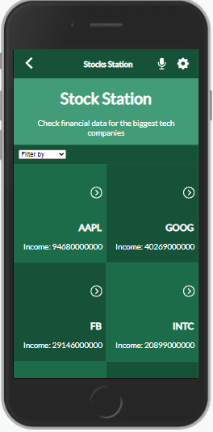

# Project Name

> Check the Financial statements of the biggest US tech companies!



## Built With

- Major languages
    - JavaScript
    - HTML & CSS
- Frameworks
    - React & Redux
- Technologies used
    - VSCode
    - Git & GitHub
    - FinancialModelingPrep API [(link here)](https://site.financialmodelingprep.com/developer/docs);
    - NPM

## Live Demo

[Live Demo Link](https://livedemo.com)


## Getting Started

To get a local copy up and running follow these simple example steps.

### Prerequisites

- Install Git Bash
- Install a code editor
- Install Node.js

### Setup

- Clone the repo using ```git clone https://github.com/JuliCarracedo/StockStation.git``` in your git Bash

### Install

- Open the created folder using your code editor.
- Using its integrated command line, run ```npm i``` to install all dependencies

### Usage

- Run ```npm start``` to deploy a local version of the app

### Run tests#

- Run ```npm test``` to run all tests using Jest

### Deployment


## Author

👤 **Julian Carracedo**

- GitHub: [@JuliCarracedo](https://github.com/JuliCarracedo)
- Twitter: [@CarracedoTrigo](https://twitter.com/CarracedoTrigo)
- LinkedIn: [Julian Carracedo](https://linkedin.com/in/julian-carracedo)

## 🤝 Contributing

Contributions, issues, and feature requests are welcome!

Feel free to check the [issues page](../../issues/).

## Show your support

Give a ⭐️ if you like this project!

## Acknowledgments

- Hat tip to anyone whose code was used
- Inspiration
- etc

## 📝 License

This project is MIT licensed.